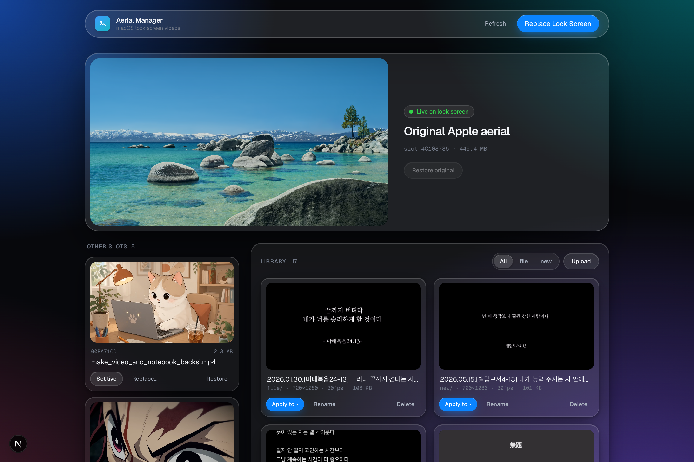

# Aerial Manager

Put **your own videos on the macOS lock screen** — through a local web UI.



macOS plays "aerial" videos on the lock screen and as a screen saver. On **macOS 26 (Tahoe)** the downloaded aerial videos live in a user-writable folder:

```
~/Library/Application Support/com.apple.wallpaper/aerials/videos/<UUID>.mov
```

Aerial Manager swaps those files with videos of your choice (converted to the HEVC `.mov` the lock screen plays), backs up the Apple originals automatically, and lets you pick which slot the lock screen displays.

## Features

- **One-click replace** — upload a video (or pick one from your library) and it becomes your lock screen
- **Video library** — browse your video folders with hover-to-play previews
- **Slot board** — see what is inside each aerial slot and which one is live, with previews
- Apply any video to any slot, restore Apple originals from backup at any time
- Switch the displayed slot without opening System Settings
- **Re-apply all** — re-run every custom slot through the current conversion
- Uploads in formats a `.mov` can't hold (e.g. AV1) are converted to H.264 in the background

## Requirements

- **macOS 26 (Tahoe)** — earlier versions store aerials in a root-owned location (`com.apple.idleassetsd`) and are not supported
- **At least one aerial wallpaper downloaded** — System Settings → Wallpaper → pick any aerial. Each downloaded aerial becomes a replaceable slot.
- **ffmpeg** — `brew install ffmpeg`
- **Node.js 20+**

## Quick start

```bash
git clone <repo-url> && cd aerial-manager
npm install
cp .env.example .env.local   # set LIBRARY_DIRS to your video folders
npm run dev                  # → http://localhost:3210
```

Click **Replace Lock Screen**, pick a video, lock your screen (Ctrl+Cmd+Q). Done.

## Configuration

| Variable | Default | Description |
| --- | --- | --- |
| `LIBRARY_DIRS` | `~/Movies` | Comma-separated folders shown in the library. Uploads go to the first one. |
| `BACKUP_DIR` | `~/.aerial-manager/backups` | Where Apple originals are backed up before the first overwrite. |
| `FFMPEG_PATH` | auto-detect | Explicit ffmpeg binary path. |
| `ALLOWED_DEV_ORIGINS` | — | Comma-separated LAN hosts allowed to open the dev server (e.g. your phone). |

## How it works

1. Your video is prepared for the lock screen: landscape HEVC is copied as-is (`ffmpeg -c copy`, no quality loss); anything else is re-encoded to HEVC with VideoToolbox, capped at 30 fps, scaled down to 1080p, and portrait/square videos are blur-padded to 16:9. Applying never modifies your library file.
2. The target slot's `<UUID>.mov` is replaced in place; the Apple original is backed up first.
3. `WallpaperAgent` is restarted so the change takes effect immediately.
4. "Set as Lock Screen" rewrites the selected `assetID` inside `~/Library/Application Support/com.apple.wallpaper/Store/Index.plist`.

The app maintains a `data/slots.json` mapping of which of your videos is inside which slot.

## Caveats

- Thumbnails in System Settings still show Apple's original previews; the played video is yours.
- The lock screen and desktop share one aerial: macOS animates it on the lock screen and shows a paused frame on the desktop. macOS has no option for a video lock screen with a separate still desktop picture, so this tool can't do that either.
- Always apply videos through the app so they are converted to the format the lock screen expects (HEVC `.mov`). A video in another format can leave a grey desktop or a black lock screen.
- macOS updates or wallpaper re-downloads may overwrite replaced slots — just re-apply.
- Slots are always **HEVC** — the macOS Tahoe lock-screen renderer only plays HEVC reliably (an H.264 slot shows a black/frozen screen). Slot previews in the web UI therefore need Safari; the library keeps H.264 sources for broad browser preview.
- The lock-screen aerial sometimes fails to resume after the Mac sleeps — a macOS issue that affects Apple's own aerials too (re-locking with Ctrl+Cmd+Q brings it back). Optional fix: auto-restart the wallpaper agent on system/display wake and screen lock with `sh scripts/install-wake-helper.sh` (needs the Xcode command line tools; log at `~/.aerial-manager/wake.log`). It also restarts whenever the screen locks, which matters on Macs that rarely sleep; pass `--no-restart-on-lock` to turn that off.
- Everything happens in user-space (`~/Library`); no sudo, no SIP changes.

Use at your own risk — this modifies files inside `~/Library/Application Support/com.apple.wallpaper`. Originals are always backed up to `BACKUP_DIR` before the first overwrite.

## Desktop app (in progress)

Aerial Manager is moving from this local web app to a native macOS menu-bar app built with [Tauri](https://tauri.app), so it no longer needs Node, a terminal, or a separate wake helper. The plan and progress are in [`docs/tauri-migration.md`](docs/tauri-migration.md). Until it ships, use the web app above.

To try the work in progress (needs [Rust](https://rustup.rs)):

```bash
npm run tauri dev
```

The desktop app reads its settings from `~/Library/Application Support/io.github.kimmjen.aerial-manager/config.json` instead of `.env.local`:

```json
{ "libraryDirs": ["/Users/you/Movies"], "backupDir": "/Users/you/.aerial-manager/backups" }
```

## Development

```bash
npm run dev          # web app dev server on :3210
npm test             # vitest unit tests
npm run lint         # eslint
npm run build        # production build (web)
npm run tauri dev    # desktop app
(cd src-tauri && cargo test)   # Rust unit tests
```

## License

[MIT](LICENSE)
